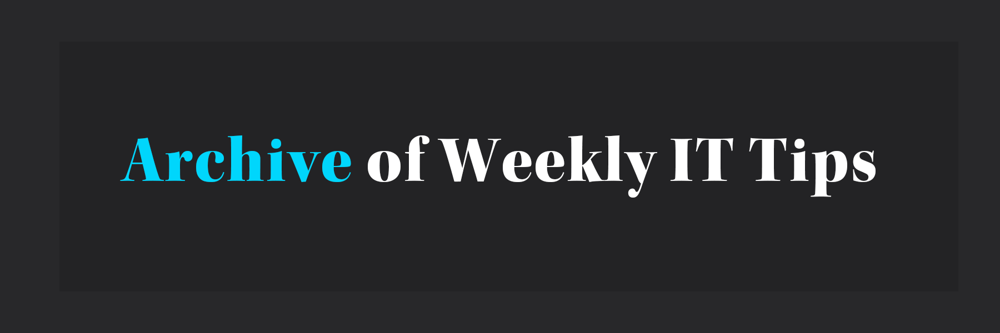

# 목차

```toc
exclude: Table of Contents
from-heading: 2
to-heading: 6
```

<br/>

## 📙 블로그

### [개발자를 위한 금융 지식과 핀테크](https://wonit.tistory.com/318?category=813540)

- 개발자를 위한 기초 금융 지식과 핀테크에 대해서 정리해 놓은 블로그이다.
- 기존의 금융업계에 it가 어떤식으로 영향을 미치고 있는지 그속에서 개발자의 역할은 무엇인지에 대해서 넓고 얕게 알아볼 수 있다.

---

<br/>

## 🎥 영상

### [모두를 위한 컴퓨터과학(CS50 2019) by David J. Malan](https://www.boostcourse.org/cs112/joinLectures/41307)

- 네이버 부스트코스에서 'CS50 : 하버드 대학교의 컴퓨터과학 입문 강좌 by David Malan' 를 번역하고 강의 자료를 정리해서 제공했다.
- 해당 강의를 열심히 듣고 과제를 수행하였을 때 컴퓨터 공학 전공과목을 수강할 수 있는 기본 교양 지식을 갖출 수 있다고 한다.
- 컴퓨팅사고(2진법,알고리즘),C언어(기초,문자열) 까지 들었는데 어렵고 따분한 cs지식을 쉽게 그리고 열정적으로 가르쳐주는 교수님 덕분에 cs의 기초에 대해서 알 수 있었다.
- 하버드 컴공 강의를 방구석에서 들을 수 있다니 이것은 축복인가 저주인가?

---

<br/>

## 🖥 오픈소스

### [코드스테이츠 그룹프로젝트 깃허브 저장소](https://github.com/codestates)

- 코드스테이츠 수료생들이 그룹프로젝트를 진행하며 만든 웹사이트들의 깃허브 레포지토리가 전부 모아져 있다.
- 다양한 프로젝트들과 그것들의 소스코드를 볼 수 있어서 포트폴리오나 사이드 프로젝트 아이디어를 얻거나 어떤식으로 진행해야할지 모를때 유용하게 쓰일 것 같다.

---

<br/>

## 🔗 유용한 링크

### [Miro](https://miro.com/)

- Flow chart를 시각화 시킬 수 있는 웹사이트이다.
- 코드스테이츠 수료생 분들이 그룹프로젝트 하면서 작성한 플로우차트 예시를 보고 너무 잘한것 같아서 우리 그룹프로젝트에 적용해봤으면 좋겠다는 생각이 들었다.
  <br/>

### [Frontend Mentor](https://www.frontendmentor.io/challenges)

- 프론트엔드 프로젝트를 디자인이나 다른 요소들을 고려하지 않고 구현해볼 수 있다.
- 스타터를 다운로드시 기본적으로 디자인적인 요소인 1. JPG images 2. basic style guide(font,color 등)를 제공한다. 3. html에 들어갈 요소도 지정해준다.
- 유료결제시 피그마나 스케치로 실제 프로젝트를 의뢰받아서 해보는 것처럼 작업할 수 있다.

---

<br/>
