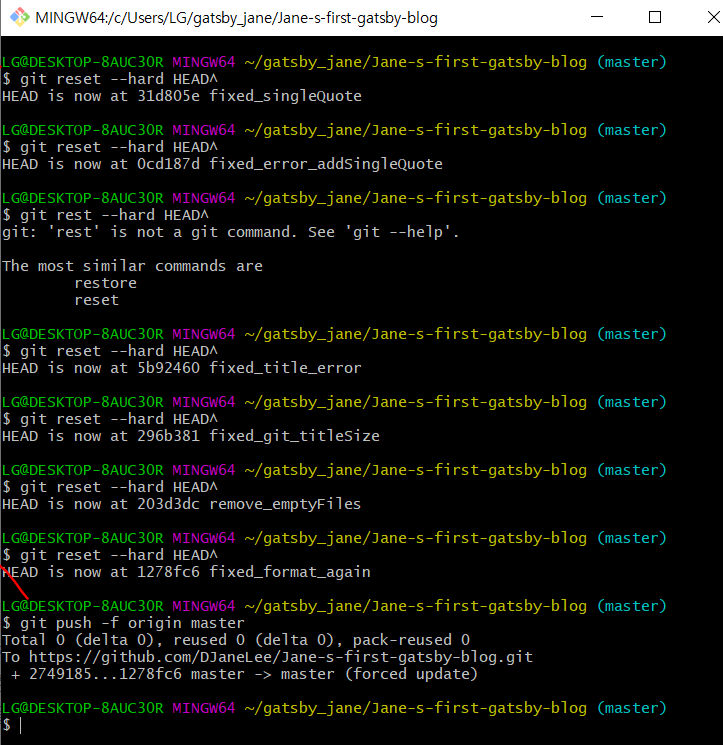

## 원격 저장소 커밋 히스토리 제어하기

| 명령어   | reset                                                                                                       | revert                                                                                                                               |
| -------- | ----------------------------------------------------------------------------------------------------------- | ------------------------------------------------------------------------------------------------------------------------------------ |
| 수행내용 | 커밋 히스토리를 강제로 조작하여 특정시점 이전의 커밋삭제                                                    | 특정 커밋을 되돌리는 작업도 하나의 커밋으로 간주하여 커밋 히스토리에 추가                                                            |
| 장점     | 원격 저장소에 다른 흔적없이 커밋들을 제거할 수 있으므로 혼자하는 작업이라면 가장 깔끔한 해결책이 될수 있다. | 특정 커밋을 되돌리는 작업조차 히스토리에 남으므로 내가 되돌린 시점을 누구나 쉽게 파악할 수 있다. 그러므로 팀으로 작업할 때 유용하다. |
| 방법     | git reset --hard HEAD^                                                                                      | git revert [되돌리고 싶은 commit의 hash]                                                                                             |

### 1. reset후 강제 push하기

#### &#128128; 주의

히스토리를 강제로 삭제하여 조작한다는 점에서 **팀과 공유하는 원격저장소**라면 혼란이 생길 수 있다.

#### &#128161; 방법

해당 로컬저장소에서 git bash나 terminal를 열어서 아래 명령문을 입력한다.

##### A-1. 바로 직전 커밋으로 되돌리고 싶은 경우

```sh
$ git reset --hard HEAD^
```

##### A-2.바로 직전부터 3개 아래의 커밋으로 되돌리고 싶은 경우

```sh
$ git reset --hard HEAD~3
```

##### B. 원하는 상태의 커밋으로 돌아왔다면 강제 푸시

```sh
$ git push -f origin master
```


위의 경우에는 원하는 시점으로 커밋을 되돌리기 위해서 6차례의 reset을 진행 후 강제 푸시하였다.

#### &#10071; 이럴때 유용하다

- 원격저장소를 개인용으로 사용하고 있는 경우
- 강제로 되돌린 커밋을 pull한 팀원이 없는 경우

### 2. revert후 강제 push하기

#### &#128204; 기대효과

원하는 과거의 시점으로 커밋이 되돌려지며 해당 내역이 히스토리에 남는다.

#### &#128161; 방법

해당 로컬저장소에서 git bash나 terminal를 열어서 아래 명령문을 입력한다.

##### A-1. 특정 커밋에서의 변경 사항을 제거하는 또 다른 커밋을 생성하고 싶은 경우

```sh
$ git revert [되돌리고 싶은 commit hash]
```

&#128553; 단점 -> 되돌리고 싶은 커밋의 수만큼 불필요한 revert 커밋이 생겨난다.

##### A-2. revert를 위한 커밋을 하나만 생성하고 싶은 경우([workingtree](https://goodenoughyoungyeom.netlify.app/Git/[Git]%20%EA%B0%9C%EB%85%90%EC%9E%A1%EA%B8%B0/)와 [index](https://goodenoughyoungyeom.netlify.app/Git/[Git]%20%EA%B0%9C%EB%85%90%EC%9E%A1%EA%B8%B0/)에만 변경사항이 적용)

```sh
$ git revert --no-commit [되돌리고 싶은 commit의 hash]
```

&#128553; 단점 -> revert할 커밋의 수만큼 명령어를 반복해서 실행해야 한다.

##### A-3. 특정 커밋 하나뿐만 아니라 여러개의 커밋에 대해서 revert 하고 싶은 경우

```sh
$ git revert --no-commit HEAD~3..
```

##### B. index에 올라간 변경들을 한꺼번에 커밋

```sh
$ git commit -m 'Revert "Commit commitName1, commitName2, commitName3"'
```

##### C. 원격저장소에 푸시

```sh
$ git push origin master
```

#### &#10071; 이럴때 유용하다

- 원격저장소를 팀원들과 함께 사용하고 있는 경우
- 히스토리에 남겨서 수정사항 또한 확인하고 싶은 경우
