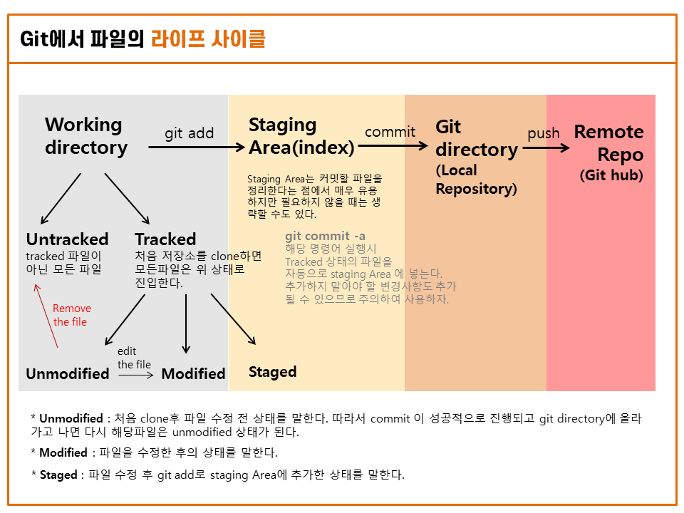

## Git 이란 무엇인가?

> 깃(Git /ɡɪt/[5])은 컴퓨터 파일의 변경사항을 추적하고 여러 명의 사용자들 간에 해당 파일들의 작업을 조율하기 위한 분산 버전 관리 시스템이다.

분산 버전 관리 시스템!?!!?!!...

위키백과에서는 분산 버전 관리 시스템으로 정의하고 있지만 사실 깃은 형상관리도구라고도 불리고 버전관리시스템(Version Control System) 이라고도 지칭되며 분산형 관리 시스템 이라고도 불리는등 여러가지의 이름을 가지고 있다.

## 버전관리시스템(Version Control System)

바쁜 작업중에 간혹 다른이름으로 저장하기가 아닌 그냥 저장을 눌러버려서 얼떨결에 지난 작업내용을 날리고 새로운 작업내용만 남게된 경험이 있는가?

Git은 친절하게도 만들어지는 모든 변경사항의 스냅샷을 저장한다. 이말은 원한다면 언제든 파일을 예전의 시점으로 돌릴 수 있다는 것이다. 따라서 어떠한 코드도 덮어쓰여져서 지워지는일이 없이 하나의 파일로 병합할 수 있다.

여기서 모든 변경사항을 버전이라고 하며, Git은 이 버전들을 효율적으로 관리할 수 있게 도와주기 때문에 Git을 버전관리시스템(VCS)이라고 부르는 것이다.

이러한 특성때문에 특히 협업을 할 때 유용하게 사용한다.

## 주요개념

Git을 설치할때 따라오는 Git Bash나 윈도우 사용자는 명령프롬프트, 맥 사용자는 터미널 에서 Git 명령어를 이용해 동작시킬 수 있다. 무엇을 사용하든 명령어는 같다.

~~나는 폴더에 접근하기위해서 해당폴더이름을 일일이 입력하지 않아도 되는 Git Bash를 선호하는 편이다.~~

따라서 Git을 사용하는데에는 명령어를 잘 입력하는것이 중요하다. 하지만 Git은 하나의 파일을 올리는데에도 여러 명령어를 입력하는 단계를 거쳐야 하므로 어떤명령어가 내 파일을 어떠한 영역으로 옮겨주고 있는지 영역에 대한 이해가 필요하다. 어떠한 영역은 눈에 보여지지 않기 때문에 더욱 헷갈릴 수 있다. ~~내가그랬다..~~

### 영역

- **Working directory(작업영역)**

→ 현재 작업중인 파일영역에서 git 이력과 관련된 정보가 저장되어 있는 .git을 제외한 모든 영역이다. 이곳에 위치한 모든 파일은 **Tracked와 Untracked**로 나뉜다.

&#128192; Tracked : 깃의 관리대상으로 들어간 상태이다. 스냅샷에 포함된 파일이기도 하다. 파일을 clone하면 모든 파일은 tracked 이면서 unmodified 상태로 진입한다.
&#128191; Untracked : 깃의 관리대상으로 포함되지 않은 모든 파일을 말한다. tracked 파일이 아닌 모든 파일에 해당한다.

- **Staging area(index, 준비공간)**

→ Modified된 파일이 git add 명령어를 받고 staged 된 상태에서 머무는 곳을 말한다.

- **Local Repository(개인저장소)**

→ Staging area에서 commit 후에 push 되기 직전에 파일이 머무는 곳을 말한다.

- **Remote Repository(원격저장소)**

→ Github,Gitlab 같은 원격 저장소를 말한다.
