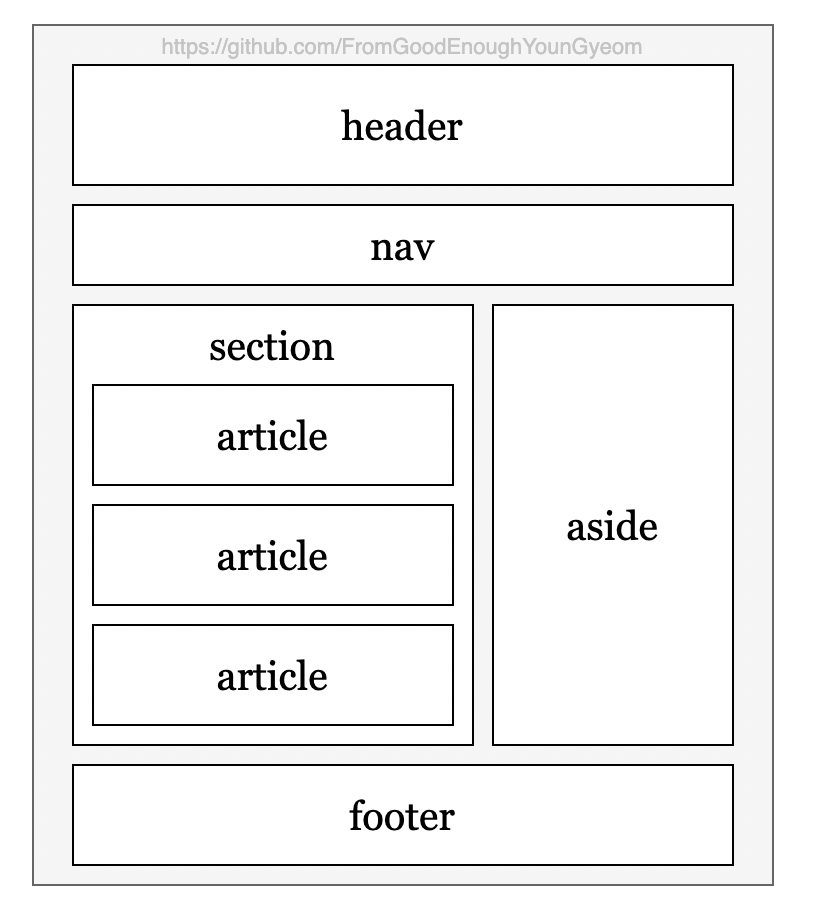

## 목차

```toc
exclude: Table of Contents
from-heading: 2
to-heading: 6
```

## 시맨틱 요소(Semantic Elements)

시맨틱 요소(Semantic Elements)는 의미가 있는 요소라는 뜻이다. 따라서 시맨틱 요소를 고려하여 만든 html은 tag의 이름만 보고도 tag 가 html 안에서 어떠한 역할을 수행하는지 브라우저와 개발자 모두 쉽게 알 수 있다.

## 사용하는 이유

### 웹 접근성 향상

시맨틱 요소를 고려하여 html을 제작한다면 tag 이름만 보고도 html 내에서 어떠한 역할을 수행하는지 브라우저 와 개발자 모두 알 수 있다고 위에서 설명한 바 있다. 이것은 웹 접근성을 높이는데 기여한다. 이렇게 웹 접근성을 높이면 웹페이지에 일반적인 방법으로 접근할 수 없는 사람들(시각장애인)이나 상황(마우스 조작이 어려울 때)에서 원활한 소통이 가능하도록 도울 수 있다. 또 모바일과 같은 새로운 기기와의 호환성을 담보할 수 있으며, 다양한 OS 및 웹 브라우저의 사용 범위가 확대된다.

### 검색엔진 최적화(SEO: Search Engine Optimization)

검색엔진 최적화 작업은 사이트 내 콘텐츠 정보를 검색엔진이 잘 이해할 수 있도록 정리하는 작업이다. 이 작업을 통하여 사이트 내 콘텐츠가 구글이나 네이버 등 검색엔진의 검색 결과에 누락되지 않도록 조치할 수 있으며, 무엇보다 사용자가 원하는 콘텐츠의 내용을 명확하게 검색엔진에게 알려 줄 수 있다.

## Layout



## List

HTML5의 semantic elements 주요 리스트를 살펴보자.

| tag name | 설명                                                                                                                               |
| -------- | ---------------------------------------------------------------------------------------------------------------------------------- |
| header   | `머리글을 지정 / 일반적으로 로고, 제목 태그(hn) 및 nav 태그를 포함한다.`                                                           |
| nav      | `메뉴에 주로 사용되며, 사이트 내의 문서로 연결(네비게이션)하는 링크의 모음으로 구성된다.`                                          |
| section  | `주제별 콘텐츠 영역을 나타내며, 제목으로 시작하는 컨텐츠를 그룹핑하기 위해 사용한다.`                                              |
| article  | `콘텐츠에 실제 내용을 포함하는 영역이다.`                                                                                          |
| aside    | `본문 이외의 내용을 표시하는 사이드바 영역으로 주로 광고나 링크 등으로 구성되며 메인 내용에 영향을 미치지 않는 내용으로 구성한다.` |
| footer   | `주로 하단에 위치하여 제작 정보, 회사소개, 약관, 저작권 정보를 포함하는 영역이다.`                                                 |

## Reference

- [웹접근성과 웹표준](https://seulbinim.github.io/WSA/accessibility.html#%EC%9B%B9%EC%A0%91%EA%B7%BC%EC%84%B1-%EC%A4%80%EC%88%98-%EC%8B%9C-%EA%B8%B0%EB%8C%80-%ED%9A%A8%EA%B3%BC)

- [빠리의 택시 운전사](https://geonlee.tistory.com/96)

- [웹마스터 가이드](https://searchadvisor.naver.com/guide/seo-basic-intro)

- [bono's blog](https://blueshw.github.io/2020/05/09/know-html-semantic-elements/#unavu)

- [joker's room](https://m.blog.naver.com/PostView.nhn?blogId=heartflow89&logNo=221170465007&proxyReferer=https:%2F%2Fwww.google.com%2F)
