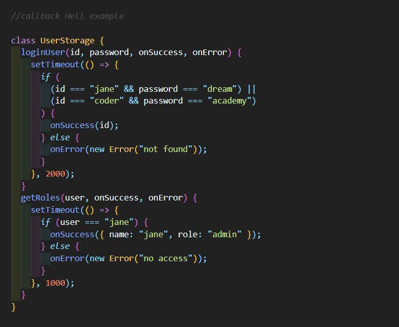
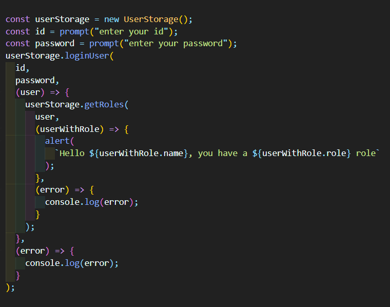

 
 

# 들어가기

콜백 함수란 무엇인가에 대해서 설명하려면 먼저 **[동기(Synchronous)](https://goodenoughyoungyeom.netlify.app/Web%20Development/[Web%20Development]%EB%8F%99%EA%B8%B0%EC%99%80%EB%B9%84%EB%8F%99%EA%B8%B0%EC%B2%98%EB%A6%AC/#%EB%8F%99%EA%B8%B0synchronous)**/**[비동기(Asynchronous)](https://goodenoughyoungyeom.netlify.app/Web%20Development/[Web%20Development]%EB%8F%99%EA%B8%B0%EC%99%80%EB%B9%84%EB%8F%99%EA%B8%B0%EC%B2%98%EB%A6%AC/#%EB%B9%84%EB%8F%99%EA%B8%B0asynchronous)** 란 무엇인가에 대한 이해가 필요하다.
 
 

> 자바스크립트 자체는 **Single-threaded**한 언어이자 **synchronous**이다.

따라서 이러한 자바스크립트의 특성에 따라 코드를 실행할 때 상위 코드의 결과값으로 실행되는 코드가 아님에도 순차적으로 진행되어 때에 따라 원치 않는 결과가 나올 수도 있다.
이럴 때 콜백 함수를 사용하면 특정 로직이 끝났을 때만 원하는 동작을 실행시킬 수 있다.
 
 

# Callback & Callback Hell

`callback`은 문자그대로 called at the back 이다.
 
 

1. 다른 함수의 인자로써 이용되는 함수이고
2. 어떤 이벤트에 의해 호출되어지는 함수라고도 할 수 있다.

 

그런데 한 로직에 콜백 함수를 여러번 사용하면 이것이 콜백 체인이 되고 지나친 콜백 체인은 `Callback Hell`을 유발할 수 있다.
 
 

## 예제

이러한 `콜백 지옥`은 코드를 한눈에 이해하기 어렵다. 따라서 에러 발생으로 인한 디버깅도 어렵다. 또한 유지 보수도 힘들게 만든다.
 
 
 
 

## 참고

- https://morioh.com/p/bb2f95f40ce3
- https://joshua1988.github.io/web-development/javascript/javascript-asynchronous-operation/
- https://www.youtube.com/channel/UC_4u-bXaba7yrRz_6x6kb_w
- https://satisfactoryplace.tistory.com/18
