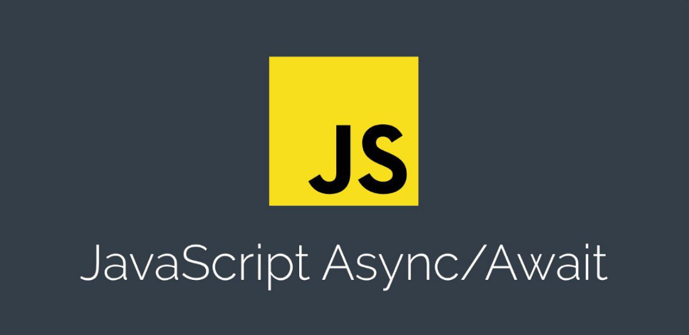
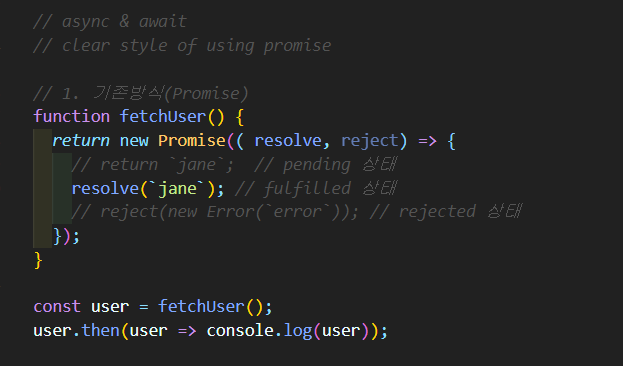
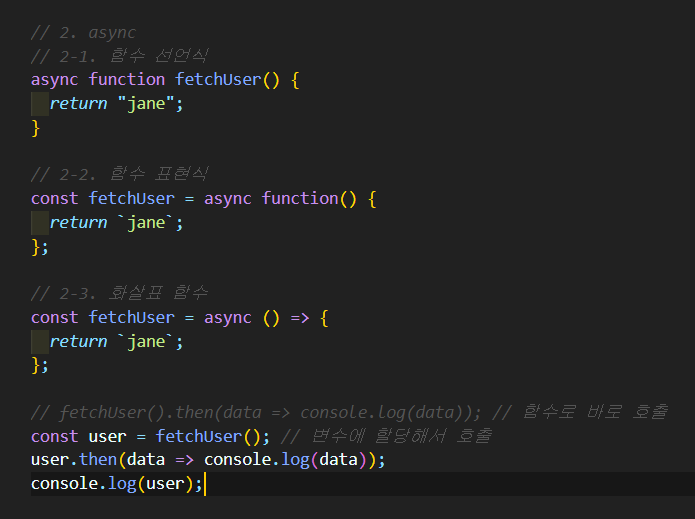
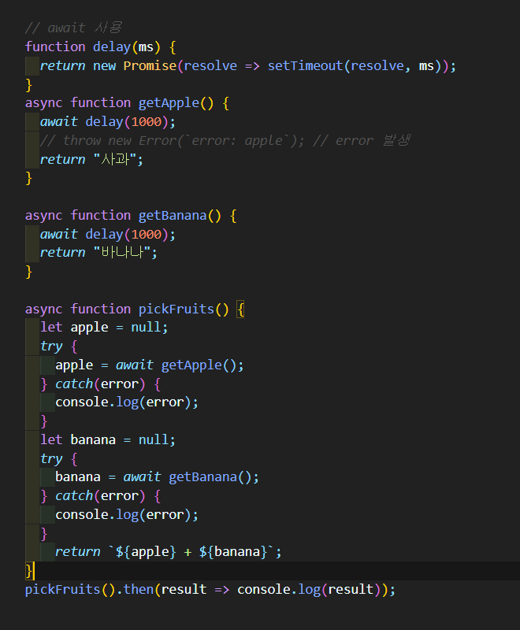

# async/await 란?

[Promise](https://goodenoughyoungyeom.netlify.app/JavaScript/[JavaScript]%20%EB%B9%84%EB%8F%99%EA%B8%B0%EC%B2%98%EB%A6%AC%EB%B0%A9%EC%8B%9D%202.%20Promise/#%ED%94%84%EB%A1%9C%EB%AF%B8%EC%8A%A4%EB%9E%80)를 간편하게 동기적으로 실행되는것처럼 보이게 해주는 API이다. 콜백함수와 `Promise`의 단점을 보완하고 개발자가 읽기 좋은 코드를 작성하게 도와준다.

<br/>
<br/>

## 기본문법

```sh
async function 함수명(){
    await 비동기처리_메서드명();
}
```

# async

## 1. 기존 Promise 방식으로 처리할 경우



`Promise`를 사용하면 반드시 resolve와 reject를 호출해야 한다.
<br/>
<br/>

## 2. 위 방식을 async 를 사용해서 처리할 경우



`async`를 사용하면 함수의 코드 블록이 자동으로 `Promise`로 변환 되어진다.
<br/>
<br/>

# await

## 1. 기존 Promise 방식으로 처리할 경우


`콜백지옥`이 떠오른다.
<br/>
<br/>

## 2. await을 사용하여 수정했을 경우


