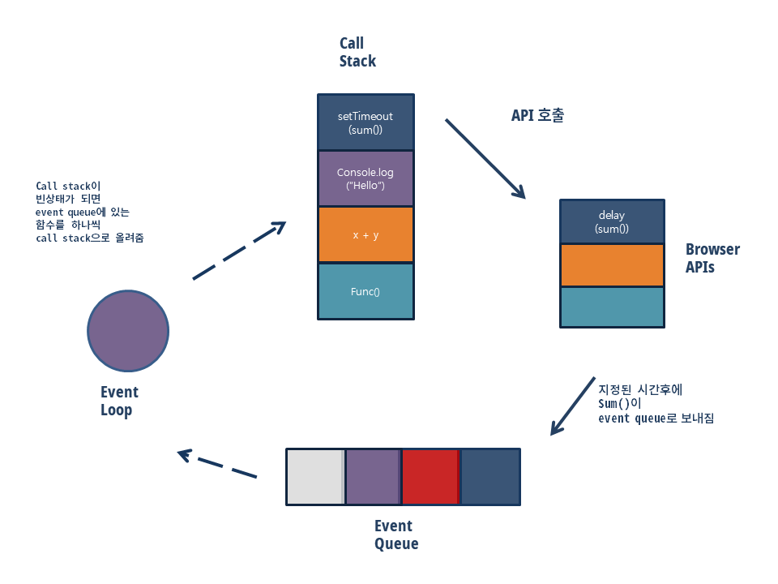

## 프로세스(process)

운영체제로부터 시스템 자원을 할당받는 작업의 단위이다. 동적인 개념으로는 실행된 프로그램을 의미한다. 기본적으로 프로세스당 최소 1개의 스레드를 가지고 있다. 프로세스는 각각 독립된 메모리 영역(Code, Data, Stack, Heap의 구조)을 할당받는다.
 
 
 

## 스레드(thread)

프로세스의 특정한 수행 경로이다. 프로세스가 할당받은 자원을 이용하는 실행의 단위이기도 하다.
 
 
 

## 싱글스레드(Single-threaded)

한번에 하나의 작업만 수행할 수 있음을 의미한다. 자바스크립트는 "엔진" (V8 엔진 등)이 싱글스레드로 동작하고, 런타임환경(브라우저/Node)이 멀티스레드를 제공한다.
 
 
 

## 이벤트루프(Event loop)

항상 루프를 돌면서 call stack과 callback queue를 확인한다. 그러다 call stack이 빈 상태가 되면, event queue(Task Queue 혹은Callback Queue라고도 지칭함)에 있는 함수를 하나씩 call stack으로 올려주는 것이다.
 
 
 
