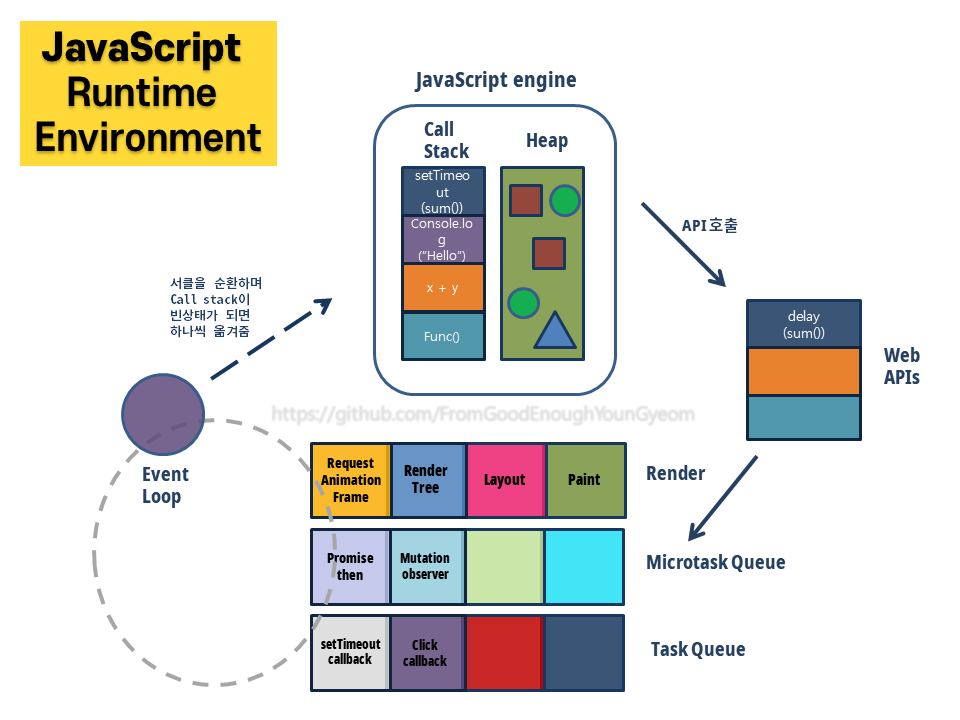

**자바스크립트 엔진**은 기본적으로 하나의 스레드에서 동작한다. **하나의 스레드**를 가지고 있다는 것은 **하나의 stack**을 가지고 있다는 의미와 같고, 하나의 stack만 있다는 의미는 **한 번에 단 하나의 작업**만을 할 수 있다는 의미이다.
 

`그런데 이러한 자바스크립트에서 어떻게 비동기적인 작업이 가능한 걸까?`
 

**자바스크립트의 런타임 환경**을 자세히 살펴보면 그 답을 찾을 수 있다.
 

위의 그림에서 볼 수 있듯이 Event Loop와 Queue는 자바스크립트 엔진이 하나의 코드 조각을 하나씩 처리할 수 있도록 작업을 스케줄 한다.
이벤트 루프는 while(true) 같은 것을 이용해서 루프를 계속 순환하고 있다. 그렇게 순환을 반복하다가 콜 스택에서 수행 중인 함수가 있다면 그 함수의 수행이 끝날 때까지 콜스택에 머무른다.
(따라서 콜스택에 등록한 함수에서 지나치게 많은 시간을 요구하는 작업을 하게 되면 사용자에게 늦은 업데이트를 유발하고 다른 클릭이 발생해도 그 클릭에 등록된 콜백함수가 실행되지 않는다. 이것은 사용자에게 불만족스러운 ux 경험을 유발할 수 있다.)
콜스택에서 수행이 끝나면 이벤트 루프는 다시 루프를 돌기 시작하는데 이때에 render 쪽으로는 갈 수도 있고 안 갈 수도 있다.
왜 render 쪽으로 갈수도 있고 안갈수도 있는지에 대해서 설명하려면 브라우저가 사용자에게 얼마나 빠르게 업데이트를 하고 있는지에 대한 이해가 필요하다. 브라우저는 기본적으로 1초 동안 60개의 프레임(60frames per second)의 속도로 사용자에게 업데이트 내용을 보여주도록 하고 있다. 인간의 눈에 어떠한 애니메이션이 자연스러워 보이기 위해서는 1초 동안 60개의 프레임이 필요하기 때문이다. 그리고 그렇게 하기 위해서는 16.7 밀리 세컨드 동안 한 번의 업데이트가 일어나야 된다.
&#128161; 여기서 잠깐! 16.7밀리 세컨드 동안 한번의 업데이트가 일어나는 브라우저에 비해 우리의 이벤트 루프는 rende r→ Microtask queue → task queue 를 다 도는데 1밀리 세컨드도 걸리지 않는다. 따라서 **이벤트 루프의 속도가 브라우저가 프레임을 업데이트하고 있는 속도보다 훨씬 빠르기 때문에 이벤트 루프는 루프를 순환하면서 매번 render를 들리지 않아도 된다.**
