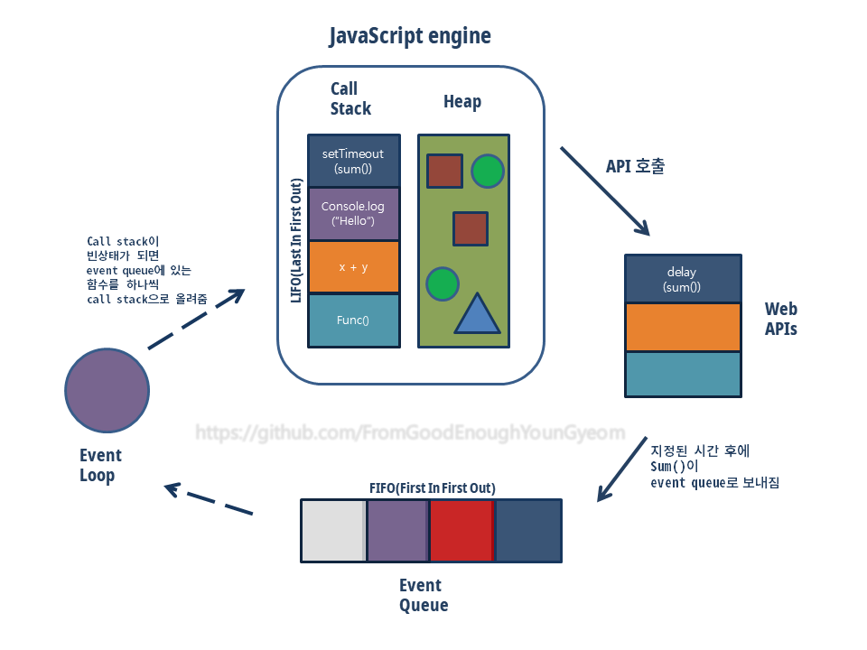
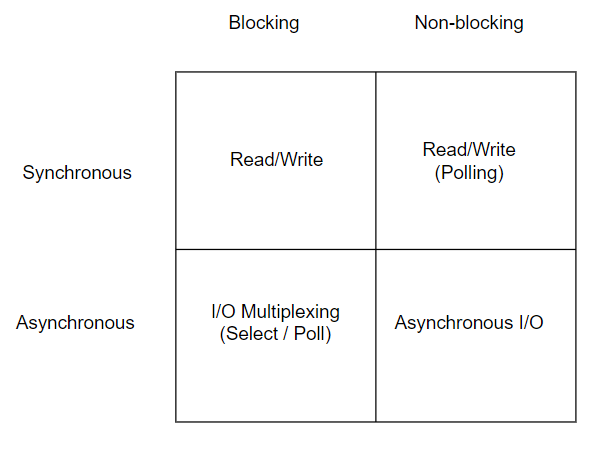

## 미리 보기

`프로세스(process)`,`코드(code) 영역`,`데이터(data) 영역`,`스택(stack) 영역`,`힙(heap) 영역`,`스레드(thread)`,`싱글스레드(Single-threaded)`,`콜스택(Call stack)`,`Web API(=Brower API)`,`테스크 큐(task Queue = event Queue)`,`이벤트루프(Event loop)`,`동시성(Concurrent)`,`비동기(Asynchronous)`,`논블로킹(Non Blocking)`

 
 

## 프로세스(process)

운영체제로부터 시스템 자원을 할당받는 작업의 단위이다. 동적인 개념으로는 **운영체제 위에서 연속적으로 실행되고 있는 프로그램**을 의미한다. 우리가 일반적으로 실행시키는 음악재생프로그램이나 사진 뷰어 프로그램은 각각의 프로세스를 가지고 있다. 기본적으로 프로세스당 최소 1개의 스레드를 가지고 있다. 프로세스는 각각 독립된 메모리 영역(Code, Data, Stack, Heap의 구조)을 할당받는다.
 

## 코드(code) 영역

실행할 프로그램의 코드가 저장되는 영역이다.
 

## 데이터(data) 영역

프로그램의 전역 변수와 정적 변수, 문자열 상수가 저장(할당)되는 영역이다.
 

## 스택(stack) 영역

**함수의 호출과 관계되는 지역변수와 매개변수가 저장되는 영역**이다. 함수들이 어떤 순서로 실행되어야 하는지 이 함수가 끝나면 어디로 다시 돌아가야 되는지에 대한 정보를 저장하고 있다. 한 쪽 끝에서만 자료를 넣고 뺄 수 있는 **LIFO(Last In First Out)**형식의 자료 구조를 가졌다. 즉, 가장 최근에 스택에 추가한 항목이 가장 먼저 제거될 항목이다.
 

## 힙(heap) 영역

**구조화 되지 않은 넓은 메모리 영역**을 지칭한다. 변수를 선언해서 오브젝트를 할당하거나 데이터를 만들 때 그 데이터들이 저장되는 공간이다.
**필요에 의해 동적으로 메모리를 할당 할 때 사용**한다. 런타임 시에 크기가 결정된다.
프로그램에 필요한 개체의 개수나 크기를 미리 알 수 없는 경우에 사용한다.
 
 
 
 

## 스레드(thread)

**프로세스의 특정한 수행 경로**이다. 프로세스가 할당받은 자원을 이용하는 실행의 단위(=일꾼)이기도 하다. 스레드는 자신이 수행해야 되는 함수의 호출을 기억해야 되기 때문에 스레드마다 스택이 할당되어져 있다. 스레드는 동시다발적으로 발생할 수 있기 때문에 프로세스가 더 효율적으로 작업을 할 수 있도록 돕는다.
 
 

## 싱글스레드(Single-threaded)

**한번에 하나의 작업만 수행할 수 있음**을 의미한다. 자바스크립트는 싱글스레드이다. 그러나 "엔진" (V8 엔진 등)이 싱글스레드로 동작하고, 런타임환경(=자바스크립트의 실행 환경,브라우저/Node)에서 다양한 방식을 이용해서 멀티스레드 같은 효과를 얻을 수 있다.
 
 
 
 

## 콜스택(Call stack)

Javascript의 런타임에서 코드가 호출되면서 스택으로 쌓이는 곳이다. 우리가 함수를 실행하는 순서에 따라서 차곡차곡 쌓아놓는다. LIFO(Last In First Out) 방식으로 실행된다.
 
 

## Web API(=Brower API)

Web api는 **웹 브라우저에서 제공하는 api**이다. 여기서 API(Application Programming Interface)란 응용 프로그램에서 사용할 수 있도록, 운영 체제나 프로그래밍 언어가 제공하는 기능을 제어할 수 있게 만든 인터페이스를 뜻한다.
Web api는 DOM 이벤트, Ajax, setTimeout 등의 비동기 작업들을 수행할 수 있도록 API를 지원한다.

 
 

## 마이크로 태스크 큐(microtask Queue)

promise나 mutation observer 를 쓰면 그것에 등록된 콜백이 마이크로 태스크 큐에 들어오게 된다. 이벤트루프는 마이크로 태스크 큐를 태스트 큐보다 우선적으로 처리한다.
 
 

## 테스크 큐(task Queue)

web api에서 비동기 작업들이 실행된 후 **호출되는 콜백함수들(우리가 흔하게 등록하는 콜백함수들)이 기다리는 공간**이다. **FIFO(First In First Out)** 방식을 따른다.
 
 

## 이벤트루프(Event loop)

이벤트 루프에 대해 설명하려면 먼저 자바스크립트가 구동되는 환경에 대한 이해가 필요하다. 자바스크립트 엔진은 단일 호출 스택(싱글스레드)을 사용한다. 그러나 실제 자바스크립트가 구동되는 환경(브라우저, Node.js등)에서는 여러 개의 스레드가 사용된다. 이벤트 루프는 **이러한 구동 환경에서 단일 호출 스택을 사용하는 자바 스크립트 엔진과 상호 연동하기 위해 사용하는 장치**이다.
이벤트 루프는

1. 항상 **루프를 돌면서** call stack과 task queue 확인한다.
2. 그러다가 **call stack이 빈 상태**가 된것을 확인하면
3. **task queue에 있는 작업을 꺼내서 call stack에** 넣는다. 한번에 하나씩만 call stack으로 올린다.

 
 
 
 

## 동시성(Concurrent)

동시성(concurrent)은 실제 물리적으로 동시에 일어나는 것이 아니라, 흐름을 실행시키는 것은 하나(자바스크립트의 경우로 봤을 때, single thread)지만 작은 타임 슬라이스(Time slice, Time quantum) 단위로 다른 흐름을 돌아가면서 실행시켜서 **동시에 일어나는 것처럼 보이게 하는 방식**이다. 논리적인 의미에서 동시 실행으로 볼수 있다.
 
 
 
 

## 비동기(Asynchronous)

Synchronous/Asynchronous는 호출되는 함수의 작업 완료 여부가 관건이다.
호출되는 함수의 작업 완료를 호출한 함수가 신경쓰면 [Synchronous](https://goodenoughyoungyeom.netlify.app/Web%20Development/[Web%20Development]%EB%8F%99%EA%B8%B0%EC%99%80%EB%B9%84%EB%8F%99%EA%B8%B0%EC%B2%98%EB%A6%AC/#%EB%8F%99%EA%B8%B0synchronous), **호출되는 함수의 작업 완료를 호출된 함수가 신경쓰면 [Asynchronous](https://goodenoughyoungyeom.netlify.app/Web%20Development/[Web%20Development]%EB%8F%99%EA%B8%B0%EC%99%80%EB%B9%84%EB%8F%99%EA%B8%B0%EC%B2%98%EB%A6%AC/#%EB%B9%84%EB%8F%99%EA%B8%B0asynchronous)** 라고 할 수 있다.
특정 코드의 연산이 끝날 때까지 기다리지 않고 바로 다음 코드를 먼저 실행하는 방식이라고 말할수도 있다. 다른 주체의 응답 상태와 상관없이 다음 동작을 수행 할 수 있다.
 
 

## 논블로킹(Non Blocking)

Blocking/NonBlocking은 호출되는 함수가 바로 리턴하느냐 마느냐가 관심사이다.
바로 리턴하지 않으면 Blocking이고, **바로 리턴하면 NonBlocking**이다. 이러한 점에서 자바스크립트는 논블로킹 언어이다.
 
 
 

## 참고

- https://prohannah.tistory.com/59
- https://www.educative.io/edpresso/what-is-an-event-loop-in-javascript
- https://velog.io/@hidaehyunlee/%EB%A9%94%EB%AA%A8%EB%A6%AC-%EA%B5%AC%EC%A1%B0%EB%A5%BC-%EC%95%8C%EC%95%84%EB%B3%B4%EC%9E%90
- https://monsieursongsong.tistory.com/4
- https://eine.tistory.com/entry/%EC%9E%90%EB%B0%94%EC%8A%A4%ED%81%AC%EB%A6%BD%ED%8A%B8-%EB%8F%99%EC%8B%9C%EC%84%B1-%EB%AA%A8%EB%8D%B8%EA%B3%BC-%EC%9D%B4%EB%B2%A4%ED%8A%B8-%EB%A3%A8%ED%94%84
- https://deveric.tistory.com/99
- http://wiki.sys4u.co.kr/
- https://homoefficio.github.io/2017/02/19/Blocking-NonBlocking-Synchronous-Asynchronous/
