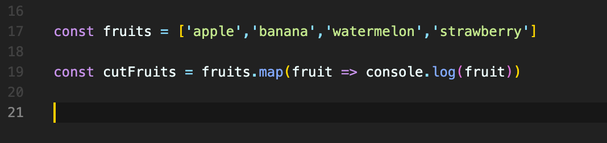
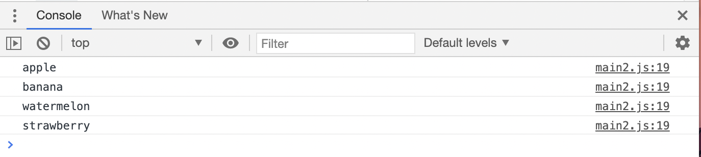
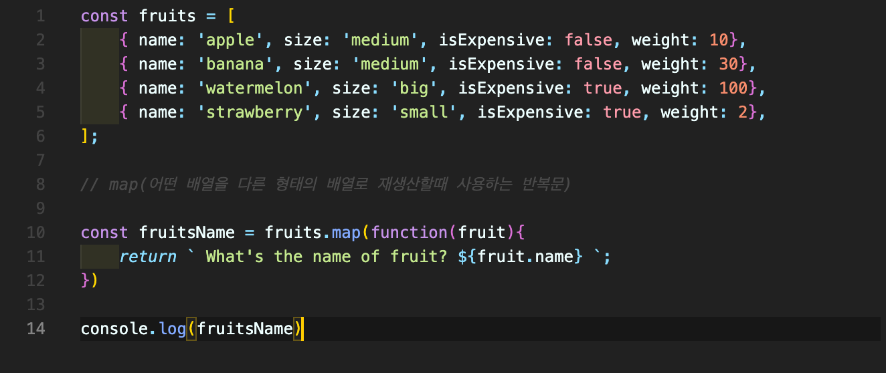
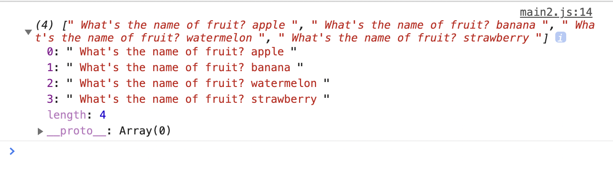
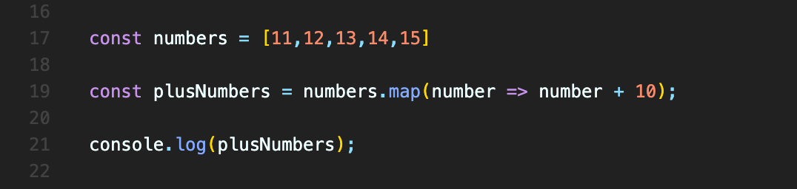
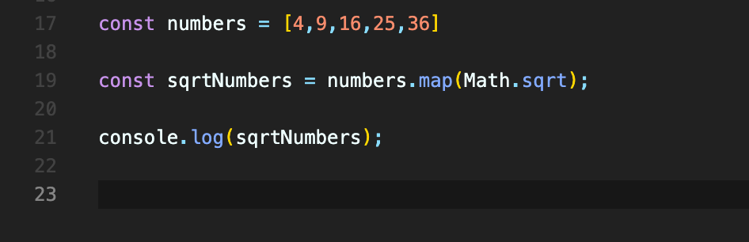
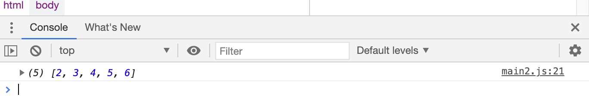

# 목차

```toc
exclude: Table of Contents
from-heading: 2
to-heading: 6
```

## Map 함수란?

`map()` 은 어떤 배열을 다른 형태의 배열로 재생산할때 사용하는 반복문이다. 배열의 `각 요소들`에게 `일괄적`으로 `함수를 적용`하고 싶을 때 사용한다.
<br/>

> array.map(callbackFunction(currenValue, index, array), thisArg)
> <br/>

> 배열.map((요소, 인덱스, 배열) => { return 요소 });

## Map 함수의 3가지 매개변수

현재요소로 쓰일 value를 제외하고 나머지는 필수입력 사항이 아니다.

- value : 현재요소
- index : 배열 내 현재 값의 인덱스
- array : map()을 호출한 배열
  <br/>

## 예시

### 기본형

<br/>



위와같이 fruits 라는 배열함수에 각 요소마다 무언가(숫자,문자 등)를 추가해서 새로운 배열을 형성하여 리턴하고 싶을 때 map()함수를 사용할 수 있다. 따라서 `fruits.map(function(...))`을 한다는 것은 fruits의 모든 요소('apple','banana','watermelon','strawberry')에 function을 실행하고 거기에서 나온 값을 저장해서 새로운 배열로 만드는 것이다.
<br/>



위의 경우에는 fruits 라는 배열함수를 map 함수를 이용해서 각각의 값이 fruit 라는 함수로 console.log 되도록 하였다. 따로 문자나 숫자 연산을 추가하지 않았으므로 하나의 배열을 이루고 있었던 각각의 값이 단순 분리되어 출력된 것을 볼 수 있다.
<br/>

### string 추가



위와같이 과일들의 이름과 사이즈 무게등을 적은 fruits 라는 배열함수를 만들고 그것을 활용할 fruitsName이라는 함수를 만들어보자.
fruitsName 함수는 return 값으로 fruits 함수에 속한 과일들의 이름을 각각 받아와서 `What's the name of fruit? 각 과일의 이름` 을 출력하게 할 것이다.
이럴 때 map 함수를 사용하면 기존배열을 건드리지 않고 우리가 원하는 요소만 가지고와서 새로운 배열을 만드는 작업이 가능하다.
<br/>



### 연산자 추가



위와같이 map 함수안에 연산자를 사용해서 각 요소마다 연산을 해준 새로운 배열을 생성할 수도 있다.
<br/>


### 제곱근함수 추가



위와같이 map 함수안에 .sqrt 함수를 사용하여 각 요소마다 제곱근을 시킨 새로운 배열을 생성할 수도 있다.
<br/>


<br/>

## Reference

- [daybreak, Javascript map함수](https://velog.io/@daybreak/Javascript-map%ED%95%A8%EC%88%98)

- [code Scalper, Javascript - map,filter, reduce](https://www.youtube.com/watch?v=vqdzVZxoRtM)
