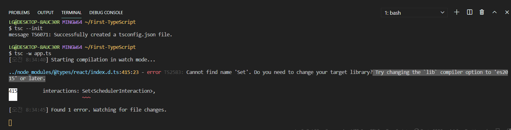
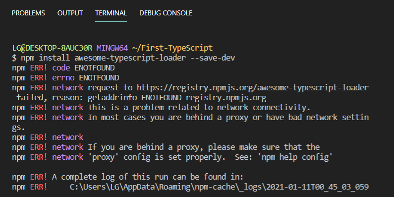
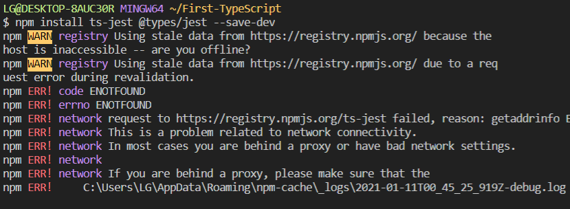
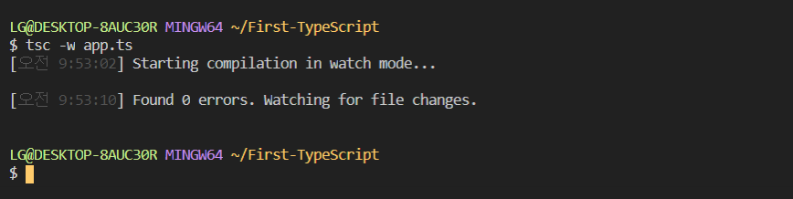

# error TS2583

> error `TS2583` : Cannot find name 'Set'. Do ynd name 'Set'. Do you need to change your target library? Try changing the lib compiler option to 'es2015' or later.

타입스크립트를 다운받고 `tsc`(typescript compiler) 명령어를 사용해서 `.ts` 파일을 `.js` 파일로 변환하려고 시도하던 중에 에러를 받았다.
 
 

자꾸만 `TS2583` 오류가 났다.
 

설정에 나도 몰랐던 오류가 있나 싶어서 [JaeYeopHan](https://jbee.io/) 님의 [typescript_playground](https://github.com/JaeYeopHan/typescript_playground)를 참고하여 npm과 설정파일을 작성했다.
 
 

transpiler를 태울 webpack이 필요한데 그 config파일과 TypeScript 설정파일인 `tsconfig.json`파일을 생성해준다.
 
 

 

위와같이 필요한 npm 모듈들을 설치한다.
 
 

 

성공적으로 해결했다. &#128517;
 
 
 

## 참고

- https://github.com/JaeYeopHan/typescript_playground
