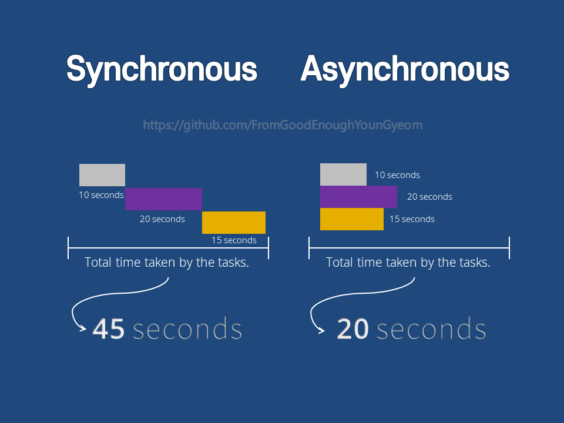

# 동기(Synchronous)

**하나의 연산이 끝나야(요청을 보낸 후 응답을 받아야) 그다음 코드가 실행**되는 방식이다. 모든 작업이 순차적으로 진행되며 어떤 작업이 실행중이라면 다음 작업은 대기하게 된다.
<br/>

```sh
console.log("1st"); // #1

console.log("2nd"); // #2

console.log("3rd"); // #3
```

위와 같은 코드를 작성하고 실행하면
<br/>

```sh
1st // #1

2nd // #2

3rd // #3
```

콘솔에는 이러한 결과가 찍힐 것이다.
<br/>
이처럼 코드가 순차적으로 실행되는 방식을 동기(Synchronous)적 처리 방식이라고 한다.
<br/>
<br/>

# 비동기(Asynchronous)

특정 코드의 연산이 끝날 때까지 **기다리지 않고 바로 다음 코드를 먼저 실행**하는 방식이다. 응답 상태와 상관없이 다음 동작을 수행 할 수 있다.
<br/>

```sh
console.log("1st"); // #1

setTimeout(()=> { console.log("2nd"); }, 0); // #2

console.log("3rd"); // #3
```

동기적 처리 방식을 설명할 때와 다르게 setTimeout() 이라는 메소드를 사용했다. setTimeout()의 첫 번째 인자는 콜백 함수이고 두 번째 인자는 지연시간이다. 위의 경우 지연시간이 0으로 지정되었으므로 지연 없이 바로 실행될 것을 예측할 수 있다. 또한 setTimeout() 메소드가 비동기적 web API라는 이해가 없다면 콘솔에 1st, 2nd, 3rd 라고 순차적으로 출력되리라고 예측할 수 있다. 그러나 **setTimeout()은 비동기적 web API** 임으로 비동기 방식으로 호출되기 때문에 0초의 지연시간을 입력했다 하더라도

```sh
1st // #1

3rd // #3

2nd // #2
```

콘솔에서는 위의 결과값이 찍히는 것을 볼 수 있다. 다시 말해 0초이던 1초이던 지정한 지연시간에 관계없이 SetTimeout()은 web api가 지원하는 비동기 함수이기 때문에 바로 실행되지 않으며 테스크 큐에 전달되어 콜스택에 바로 쌓이는 다른 함수들(동기적 처리 방식을 가진)보다 늦게 호출된다.
<br/>
<br/>

# 비동기적 처리의 필요성

Ajax Web API처럼 **원하는 데이터를 서버로 부터 받아와야 하는 코드**를 만들고 있다고 가정해 보자.
이러한 코드를 비동기적 처리를 하지 않고 **동기적 처리를 해야 한다면** 서버로부터 데이터를 받아오는 코드의 실행이 완전히 끝날 때까지 모든 것을 기다려야 하므로 **전체 페이지의 로딩 시간이 굉장히 지연**되는 것으로 보일 수 있다.
이러한 것들을 해결하기 위해 데이터의 수신과 같이 기다려야 하는 코드들을 비동기적으로 처리하는 것이다.
<br/>
<br/>

## 참고

- https://velog.io/@daybreak/%EB%8F%99%EA%B8%B0-%EB%B9%84%EB%8F%99%EA%B8%B0-%EC%B2%98%EB%A6%AC
- https://pro-self-studier.tistory.com/89
